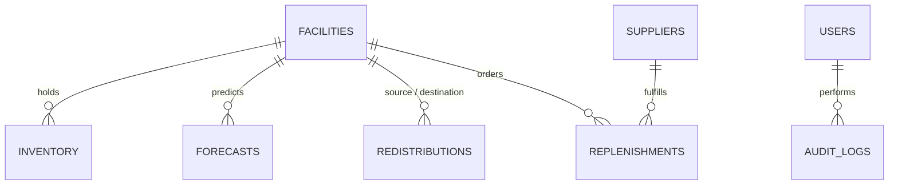

# TRACKMEDS — Firestore Structured Database Schema & Architecture

## Overview
This document defines the production-grade, NoSQL structured database schema for **TRACKMEDS (Autonomous Health Supply Chain Resilience Command Center for BRICS Nations)** in Google Firebase Cloud Firestore.

The schema is optimized for:
- Low-latency geospatial and facility reads
- Real-time inventory status synchronization
- Multi-criteria FEFO (First-Expired, First-Out) redistribution tracking
- Hierarchical Role-Based Access Control (National Admin, State Officer, District Officer, PHC Staff, Supplier)
- Cross-country BRICS aggregation (India, Brazil, South Africa, Russia, China)

---

## Collections Architecture



---

## 1. `facilities` Collection
**Path:** `/facilities/{facilityId}`  
**Example ID:** `FAC-IN-101`, `FAC-BR-401`

| Field | Type | Description |
|---|---|---|
| `id` | string | Unique facility ID |
| `name` | string | Facility display name (e.g. "UBS Central São Paulo") |
| `type` | string | `PHC`, `CHC`, `DH`, `DEPOT`, `CLINIC` |
| `district` | string | District or municipality name |
| `state` | string | State or province name |
| `country` | string | `India`, `Brazil`, `South Africa`, `Russia`, `China` |
| `latitude` | number | Geospatial coordinate (e.g. -23.5505) |
| `longitude` | number | Geospatial coordinate (e.g. -46.6333) |
| `population_served` | number | Estimated catchment population |
| `capacity` | number | Facility baseline throughput |
| `status` | string | `Healthy`, `Moderate`, `Warning`, `Critical` |
| `stock_health_score`| number | 0 to 100 stock resilience score |
| `critical_medicines_count` | number | Number of medicines currently under safety stock |
| `resilience_score` | number | Composite resilience rating (0 to 100) |
| `main_factors` | array<string>| Contributing factors (e.g. `['ORS Deficit', 'Bed Over-capacity']`) |
| `total_beds` | number | Total physical bed capacity |
| `occupied_beds` | number | Currently admitted inpatient count |
| `available_beds` | number | `total_beds - occupied_beds` |
| `emergency_beds` | number | Emergency triage beds |
| `icu_beds` | number | Intensive care unit beds |
| `occupancy_rate` | number | Percentage of bed utilization |
| `bed_risk_status` | string | `NORMAL`, `WARNING`, `CRITICAL` |
| `doctors_required` | number | Staffing standard for physicians |
| `doctors_available` | number | Present physicians on duty |
| `nurses_required` | number | Staffing standard for nurses |
| `nurses_available` | number | Present nurses on duty |
| `support_required` | number | Paramedical and support staff required |
| `support_available` | number | Present support staff |
| `staffing_percentage`| number | Percentage of total staff filled |
| `staff_risk_status` | string | `HEALTHY`, `WARNING`, `CRITICAL` |
| `created_at` | timestamp | Document creation timestamp |
| `updated_at` | timestamp | Document update timestamp |

---

## 2. `inventory` Collection
**Path:** `/inventory/{inventoryId}`  
**Example ID:** `INV-101-ORS`, `INV-401-ORS`

| Field | Type | Description |
|---|---|---|
| `id` | string | Unique inventory item record ID |
| `facility_id` | string | Reference to parent `facilities` document |
| `facility_name` | string | Denormalized facility name for instant UI rendering |
| `medicine_id` | string | Identifier code (e.g. `MED-ORS`, `MED-AMX`) |
| `medicine_name` | string | Medicine generic name (e.g. "Oral Rehydration Salts 20.5g") |
| `category` | string | `Rehydration`, `Antibiotics`, `Analgesics`, `Chronic`, `Vaccines` |
| `unit` | string | `sachets`, `tablets`, `vials`, `bottles` |
| `batch_number` | string | Batch tracking code (e.g. `B-2026-0401`) |
| `quantity` | number | Current physical count in stock |
| `expiry_date` | string (ISO) | Batch expiry date (`YYYY-MM-DD`) |
| `days_to_expiry` | number | Calculated days until expiration |
| `daily_consumption`| number | Average daily consumption rate |
| `safety_stock_level`| number | Minimum threshold before stockout alert triggers |
| `predicted_stockout_date`| string (ISO)| Machine learning forecasted stock exhaustion date |
| `days_to_stockout` | number | Days remaining before zero inventory |
| `risk_level` | string | `Low`, `Medium`, `High`, `Critical` |
| `last_updated` | timestamp | Timestamp of last stock balance update |

---

## 3. `redistributions` Collection
**Path:** `/redistributions/{redistributionId}`  
**Example ID:** `RD-FAC-BR-404-FAC-BR-401-MED-ORS`

| Field | Type | Description |
|---|---|---|
| `id` | string | Unique transfer recommendation ID |
| `source_facility_id` | string | Sending surplus hub facility ID |
| `source_facility_name` | string | Sending surplus hub display name |
| `destination_facility_id` | string | Receiving deficit clinic facility ID |
| `destination_facility_name` | string | Receiving deficit clinic display name |
| `country` | string | Country jurisdiction (`Brazil`, `India`, etc.) |
| `medicine_id` | string | Medicine ID being redistributed |
| `medicine_name` | string | Medicine name |
| `quantity` | number | Transfer package quantity |
| `distance_km` | number | Transit distance between hubs |
| `reason` | string | Human-readable logistics optimization rationale |
| `status` | string | `Recommended`, `Approved`, `In-Transit`, `Delivered`, `Cancelled` |
| `estimated_waste_avoided_value` | number | Value of stock saved from expiry in local currency |
| `currency` | string | `INR`, `BRL`, `ZAR`, `CNY`, `RUB` |
| `ai_explanation` | string | Gemini AI reasoning for clinical audit compliance |
| `approved_by` | string (optional)| User ID of authorizing official |
| `approved_at` | timestamp (optional)| Time of dispatch authorization |
| `created_at` | timestamp | Generation timestamp |

---

## 4. `replenishments` Collection
**Path:** `/replenishments/{replenishmentId}`  
**Example ID:** `RPL-FAC-IN-101-MED-AMX`

| Field | Type | Description |
|---|---|---|
| `id` | string | Unique purchase order recommendation ID |
| `facility_id` | string | Target facility ID needing supplier fulfillment |
| `facility_name` | string | Target facility name |
| `country` | string | Target country |
| `medicine_id` | string | Medicine ID required |
| `medicine_name` | string | Medicine name |
| `quantity_required` | number | Recommended purchase quantity |
| `urgency` | string | `Low`, `Medium`, `High`, `Critical` |
| `expected_stockout_date` | string (ISO) | Anticipated stockout date without PO |
| `recommended_supplier_id`| string | Reference to `suppliers` collection |
| `recommended_supplier_name`| string| Supplier organization name |
| `status` | string | `Recommended`, `Approved`, `Dispatched`, `Completed` |
| `reason` | string | Sourcing explanation (e.g. Lead time vs Days to Stockout) |
| `created_at` | timestamp | Generation timestamp |

---

## 5. `suppliers` Collection
**Path:** `/suppliers/{supplierId}`  
**Example ID:** `SUP-01`, `SUP-03`

| Field | Type | Description |
|---|---|---|
| `id` | string | Unique supplier partner ID |
| `name` | string | Supplier corporate name (e.g. "Fiocruz Farmanguinhos") |
| `region` | string | State / Region and Country |
| `country` | string | Operating country |
| `average_lead_time_days` | number | Average delivery latency in business days |
| `reliability_score` | number | Score between 0.00 and 1.00 |
| `contact_status` | string | `Active`, `Restricted`, `Standby` |
| `created_at` | timestamp | Record creation timestamp |

---

## 6. `forecasts` Collection
**Path:** `/forecasts/{forecastId}`  
**Example ID:** `FC-FAC-101-ORS`

| Field | Type | Description |
|---|---|---|
| `id` | string | Forecast record ID |
| `facility_id` | string | Monitored facility reference |
| `facility_name` | string | Facility name |
| `country` | string | Country name |
| `medicine_id` | string | Medicine ID |
| `medicine_name` | string | Medicine name |
| `current_stock` | number | Present stock units |
| `forecast_period_days` | number | Prediction window (e.g. 14, 30, 90) |
| `predicted_demand` | number | Expected total consumption during window |
| `projected_stock_deficit`| number | Units below safety stock |
| `risk_level` | string | `Low`, `Medium`, `High`, `Critical` |
| `confidence_score` | number | Model confidence percentage (e.g. 94.2) |
| `created_at` | timestamp | Forecast computation timestamp |

---

## 7. `users` Collection
**Path:** `/users/{userId}`  
**Example ID:** `USR-ADMIN-01`, `USR-PHC-01`

| Field | Type | Description |
|---|---|---|
| `id` | string | Unique user ID |
| `email` | string | Authorized user email |
| `name` | string | Full name |
| `role` | string | `NATIONAL_ADMIN`, `STATE_OFFICER`, `DISTRICT_OFFICER`, `PHC_STAFF`, `SUPPLIER` |
| `country` | string | Assigned country |
| `state` | string (optional) | Assigned state for State Officers |
| `district` | string (optional) | Assigned district for District Officers |
| `facility_id` | string (optional) | Assigned clinic ID for PHC Staff |
| `supplier_id` | string (optional) | Assigned supplier ID for Supplier Partners |
| `created_at` | timestamp | Account creation timestamp |

---

## 8. Firestore Security Rules (`firestore.rules`)

```javascript
rules_version = '2';
service cloud.firestore {
  match /databases/{database}/documents {
    
    // Helper functions
    function isAuthenticated() {
      return request.auth != null;
    }
    
    function getUserData() {
      return get(/databases/$(database)/documents/users/$(request.auth.uid)).data;
    }
    
    function isNationalAdmin() {
      return isAuthenticated() && getUserData().role == 'NATIONAL_ADMIN';
    }

    // Public read for monitored facilities and inventory in public health command mode
    match /facilities/{facilityId} {
      allow read: if true;
      allow write: if isNationalAdmin();
    }
    
    match /inventory/{inventoryId} {
      allow read: if true;
      allow write: if isAuthenticated();
    }
    
    match /redistributions/{redistributionId} {
      allow read: if true;
      allow update: if isAuthenticated();
      allow create, delete: if isNationalAdmin();
    }
    
    match /replenishments/{replenishmentId} {
      allow read: if true;
      allow update: if isAuthenticated();
      allow create, delete: if isNationalAdmin();
    }
    
    match /suppliers/{supplierId} {
      allow read: if true;
      allow write: if isNationalAdmin();
    }
    
    match /forecasts/{forecastId} {
      allow read: if true;
      allow write: if isNationalAdmin();
    }
    
    match /users/{userId} {
      allow read: if isAuthenticated();
      allow write: if isNationalAdmin() || request.auth.uid == userId;
    }
  }
}
```

---

## 9. Recommended Composite Indexes (`firestore.indexes.json`)

```json
{
  "indexes": [
    {
      "collectionGroup": "inventory",
      "queryScope": "COLLECTION",
      "fields": [
        { "fieldPath": "facility_id", "order": "ASCENDING" },
        { "fieldPath": "risk_level", "order": "ASCENDING" }
      ]
    },
    {
      "collectionGroup": "redistributions",
      "queryScope": "COLLECTION",
      "fields": [
        { "fieldPath": "country", "order": "ASCENDING" },
        { "fieldPath": "status", "order": "ASCENDING" }
      ]
    },
    {
      "collectionGroup": "facilities",
      "queryScope": "COLLECTION",
      "fields": [
        { "fieldPath": "country", "order": "ASCENDING" },
        { "fieldPath": "status", "order": "ASCENDING" }
      ]
    }
  ]
}
```
