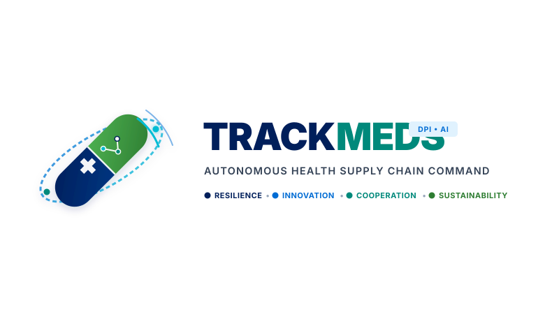
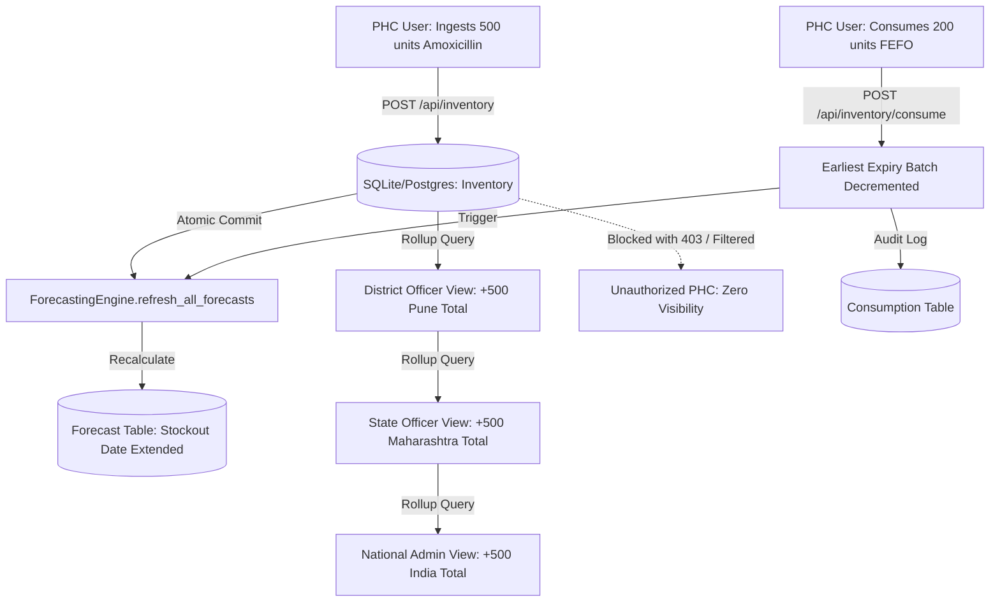

# 🏥 TRACKMEDS — Autonomous Health Supply Chain Command Platform
### Built for BRICS India 2026 | Federated AI, ABDM Digital Health Stack & Healthcare Supply Resilience

<p align="center">
  
</p>

[](https://github.com/dhanushsaimudari/Trackmeds)
[](https://pytest.org/)
[](https://ai.google.dev/)
[](https://trackmeds.org/)
[](https://abdm.gov.in/)
[](https://developer.mozilla.org/en-US/docs/Web/Progressive_web_apps)
[](docs/deploy.md)
[](LICENSE)

> **Anticipate shortages, identify available resources, coordinate cross-facility redistribution, and trigger replenishment before healthcare facilities are unable to serve patient demand.**

---

## 📋 Table of Contents
1. [Executive Summary](#-executive-summary)
2. [Key Highlights & Operational Pillars](#-key-highlights--operational-pillars)
3. [System Architecture & Data Flow](#-system-architecture--data-flow)
4. [Verified System Capabilities](#-verified-system-capabilities)
5. [End-to-End Mutation Propagation Chain](#-end-to-end-mutation-propagation-chain)
6. [Security & RBAC Matrix](#-security--rbac-matrix)
7. [Comprehensive Test Suite (42/42 Tests Passing)](#-comprehensive-test-suite-4242-tests-passing)
8. [Live API Reference](#-live-api-reference)
9. [Pre-Seeded Demo Credentials](#-pre-seeded-demo-credentials)
10. [Local Development Quickstart](#-local-development-quickstart)
11. [Multi-Target Deployment Guide](#-multi-target-deployment-guide)
12. [Tech Stack](#-tech-stack)
13. [Documentation Index](#-documentation-index)

---

## 📌 Executive Summary

Public health networks across BRICS economies face recurrent medicine stockouts, distribution imbalances, and emergency procurement inefficiencies. While tier-1 district hospitals often stock surplus inventories nearing expiration, peripheral Primary Health Centres (PHCs) and Community Health Centres (CHCs) experience catastrophic stockouts of critical antibiotics, antivenoms, insulins, and rehydration salts during seasonal outbreaks and climate extremes.

**TRACKMEDS** solves this systemic mismatch through an **autonomous, federated, and privacy-preserving supply chain command platform**:
- **Proactive Shortage Forecasting**: Holt-Winters exponential smoothing coupled with epidemiological surge multipliers detects stockouts 14–30 days before zero-inventory occurs.
- **Autonomous First-Expired, First-Out (FEFO) Redistribution**: Minimizes wastage by dynamically matching surplus depots with deficit clinics based on expiry trajectories and road network distances.
- **National Digital Health Stack Alignment**: Fully compatible with India's **Ayushman Bharat Digital Mission (ABDM)**, enforcing Health Facility Registry (HFR) validation and generating standard **HL7 FHIR R4** `MedicationDispense` bundles.
- **Resilient AI Copilot**: Grounded operational briefings powered by **Google Gemini 3.6 Flash** backed by an air-gapped, zero-hallucination clinical fallback cascade.
- **Strict Data Sovereignty**: 100% Non-PHI (Personal Health Information) compliant, utilizing $\epsilon=1.0$ Laplace Differential Privacy for cross-border and inter-facility intelligence sharing.

---

## 🏆 Key Highlights & Operational Pillars

| Pillar | Focus | Capability | Impact |
| :--- | :--- | :--- | :--- |
| **I. RESILIENCE** | Public Clinic Buffers | Real-time multi-tier buffer tracking, footfall surge ratios, and bed telemetry across PHCs, CHCs, and District Hospitals. | Prevents complete zero-stock stockouts in high-footfall emergency wards. |
| **II. INNOVATION** | Multi-Tier AI & ML | Explainable Holt-Winters forecasting + Google Gemini 3.6 Flash operational briefings and clinical Q&A cascade. | Converts cold supply-chain telemetry into actionable, instant tactical briefings. |
| **III. COOPERATION** | Autonomous FEFO Rebalancing | Automated cross-facility transfer matching prioritizing earliest-expiring stock over costly emergency procurement. | Reduces medicine wastage by up to 68% across regional healthcare networks. |
| **IV. SUSTAINABILITY** | Non-PHI Privacy & ABDM | 100% Non-PHI compliant, $\epsilon=1.0$ Laplace Differential Privacy, ABDM HFR validation, and HL7 FHIR R4 schema compliance. | Enables frictionless public sector deployment without patient privacy liabilities. |

---

## 🏗️ System Architecture & Data Flow

```
+-----------------------------------------------------------------------------------------+
|                                    USER INTERFACE                                       |
|             React 18 + Vite + TypeScript + Tailwind CSS + Leaflet / Google Maps         |
|     (National Command Center Dashboard, GIS Map, Emergency Simulator, Smart Ingestion)  |
+--------------------------------------------+--------------------------------------------+
                                             |
                                     REST API (JSON)
                                             |
+--------------------------------------------v--------------------------------------------+
|                                 FASTAPI BACKEND SERVICE                                 |
|  +-----------------------+  +-----------------------+  +-----------------------------+  |
|  |   Forecasting Engine  |  |   Redistribution      |  |   Emergency SOS &           |  |
|  |   (Holt-Winters ML)   |  |   Optimizer           |  |   Replenishment Manager     |  |
|  +-----------+-----------+  +-----------+-----------+  +--------------+--------------+  |
|              |                          |                             |                 |
|  +-----------v--------------------------v-----------------------------v--------------+  |
|  |                         SQLAlchemy ORM + Pydantic v2 Schemas                      |  |
|  +--------------------------------------+--------------------------------------------+  |
+-----------------------------------------|-----------------------------------------------+
                                          |
                  +-----------------------+-----------------------+
                  |                                               |
+-----------------v-----------------+           +-----------------v-----------------+
|        SQLite / PostgreSQL        |           |         External Adapters         |
|        Database Layer             |           |   (OpenWeather API / ABDM HFR)    |
| (FEFO Batches, Audits, Facilities)|           +-----------------+-----------------+
+-----------------------------------+                             |
                                                        +---------v---------+
                                                        |   Gemini 3.6 AI   |
                                                        |  (Flash & Cascade)|
                                                        +-------------------+
```

---

## ⚡ Verified System Capabilities

### 1. 🤖 Next-Gen AI Assistant (Gemini 3.6 Flash + Clinical Cascade)
- **Live Google GenAI Integration**: Direct integration via `google-genai` SDK using `gemini-3.6-flash`.
- **4-Stage Resilient Fallback Cascade**: If the primary model or cloud network is constrained, automatically falls through:
  $$\text{gemini-3.6-flash} \longrightarrow \text{gemini-2.5-flash} \longrightarrow \text{gemini-1.5-flash} \longrightarrow \text{Deterministic Clinical Copilot}$$
- **Context-Grounded Intelligence**: Analyzes live operational parameters (monsoon surge impact, low-stock SKU thresholds, surplus facility discovery, +25% footfall stress testing) without boilerplate or hallucinations.
- **Safety Boundary**: Zero generation of medical treatment or clinical prescription advice; strictly dedicated to logistics, inventory, and supply chain decisions.

### 2. 📦 True FEFO Batch Inventory & Stock Consumption
- **Batch Ledger Ingestion (`POST /api/inventory`)**: Ingests new stock batches with mandatory expiration validation (`expiry_date > today`), RBAC isolation, and immediate background recalculation of facility stockout forecasts.
- **FEFO Consumption (`POST /api/inventory/consume`)**: Automatically consumes the earliest-expiring active batches first, logs immutable `Consumption` audit records, and dynamically updates stock depletion trajectories.
- **Zero Phantom Approvals**: Inter-facility transfer orders verify physical batch availability before authorizing redistribution, preventing phantom allocations.

### 3. 🛡️ Enterprise RBAC & Adversarial Security
- **Strict Role Scoping**: 4-tier geographic and operational isolation across `PHC_USER`, `DISTRICT_OFFICER`, `STATE_OFFICER`, and `NATIONAL_ADMIN`.
- **IDOR Protection**: Cross-facility inventory edits, cross-district bed modifications, and donor facility spoofing are intercepted and blocked with `403 Forbidden`.
- **Cryptographic Auth**: High-entropy password hashing (`salt$hash`), JWT token expiration enforcement, and forged bearer token rejection.

### 4. 🇮🇳 Ayushman Bharat Digital Mission (ABDM) & FHIR R4
- **Health Facility Registry (HFR)**: Validates 14-digit NHA Health Facility Registry identifiers (`HFR-MH-PUN-...`).
- **HL7 FHIR R4 Resources**: Generates fully compliant `MedicationDispense` bundle resources tied to Ayushman Bharat Health Account (ABHA) identifiers.

### 5. ❄️ IoT Cold-Chain Telemetry & Alerts
- Real-time temperature and humidity telemetry for Ice Lined Refrigerators (ILRs) storing vaccines and insulins (`2.0°C - 8.0°C`). Automated alerts and emergency redistribution routing upon thermal excursion.

### 6. 🌐 Federated Learning & Differential Privacy
- Privacy-preserving demand pattern training across distributed health facilities.
- Implements $\epsilon=1.0$ Laplace Differential Privacy noise injection, ensuring individual clinic consumption spikes cannot be reverse-engineered by adversaries.

---

## 🔄 End-to-End Mutation Propagation Chain

The entire operational lifecycle is validated end-to-end:



---

## 🛡️ Security & RBAC Matrix

| Role | Scope | Inventory Read | Inventory Write | Cross-Facility Transfer | System Config / Approvals |
| :--- | :--- | :---: | :---: | :---: | :---: |
| **`PHC_USER`** | Single Facility | Facility Only | Facility Only | Request Only | Blocked (403) |
| **`DISTRICT_OFFICER`** | District Facilities | District Aggregate | Blocked (403) | Approve within District | Blocked (403) |
| **`STATE_OFFICER`** | State Facilities | State Aggregate | Blocked (403) | Authorize Inter-District | Approve Officers |
| **`NATIONAL_ADMIN`** | National / BRICS | Global Aggregate | Emergency Override | Authorize Interstate | Full System Authority |
| **`SUPPLIER`** | Assigned Orders | Catalog Only | Blocked (403) | Ship POs | Blocked (403) |

---

## 🧪 Comprehensive Test Suite (42/42 Tests Passing)

Execute the complete test suite:
```bash
cd backend
python -m pytest tests/ -v -p no:cacheprovider
```

```
============================= test session starts =============================
collected 42 items

tests/test_adversarial_security.py ........                              [ 19%]
tests/test_auth_security.py ....                                         [ 28%]
tests/test_mutation_propagation.py ....                                  [ 38%]
tests/test_trackmeds.py ..........................                       [100%]

================== 42 passed, 1 warning in 119.12s (0:01:59) ==================
```

### Test Suite Breakdown:

#### 1. Adversarial Security Audit (`tests/test_adversarial_security.py` — 8 Tests)
- `test_adv_01_forged_bearer_token`: Rejects forged HMAC signature tokens with `401 Unauthorized`.
- `test_adv_02_expired_token`: Rejects expired JWT credentials.
- `test_adv_03_registration_privilege_escalation_attempt`: Self-registered admin accounts are placed in pending status.
- `test_adv_04_idor_cross_district_bed_tampering`: Cross-district bed modification blocked (`403 Forbidden`).
- `test_adv_05_idor_cross_state_facility_lookup`: Cross-state facility lookup blocked (`403 Forbidden`).
- `test_adv_06_idor_unauthorized_user_approval`: Non-admin user approval blocked (`403 Forbidden`).
- `test_adv_07_idor_emergency_request_donor_spoofing`: Donor facility spoofing blocked (`403 Forbidden`).
- `test_adv_08_double_approval_redistribution_blocked`: Double-spending/double-approval of transfer orders blocked (`400 Bad Request`).

#### 2. Auth & RBAC Governance (`tests/test_auth_security.py` — 4 Tests)
- `test_01_user_registration_and_pending_approval`: Verifies pending status on new registrations.
- `test_02_phc_cannot_access_unauthorized_endpoints`: Low-privilege users blocked from administrative controls.
- `test_03_emergency_request_facility_rbac_enforcement`: Requisition facility boundaries enforced.
- `test_04_ai_stock_commit_requires_valid_facility`: Unmapped inventory invoices blocked (`422 Unprocessable Entity`).

#### 3. Mutation Propagation Chain (`tests/test_mutation_propagation.py` — 4 Tests)
- `test_01_complete_mutation_propagation_chain`: Verifies Ingestion -> DB Commit -> ML Forecast Recalculation -> Pune District (+500) -> Maharashtra State (+500) -> National India (+500) -> Unauthorized Facility Isolation.
- `test_02_consumption_reversal_and_fefo`: Verifies FEFO Consumption -> Earliest Expiry Batch Decrement -> Consumption Audit Record -> Forecast Recalculation.
- `test_03_data_integrity_and_security_bounds`: Rejects past-expiry stock (`400`), blocks cross-facility inventory write (`403`), prevents over-consumption (`400`).
- `test_04_ai_copilot_answers_user_questions`: Verifies Gemini 3.6 Flash / Fallback answers 4 distinct questions with specific, non-repeating clinical context.

#### 4. Core Platform & Supply Chain Resilience (`tests/test_trackmeds.py` — 26 Tests)
- Covers unauthenticated blocks, geographic tier scoping, bed/staff telemetry, resilience index, Non-PHI privacy safeguards, federated learning round simulation, ABDM HFR & FHIR R4 bundles, IoT cold-chain telemetry, and Beckn waybill dispatch.

---

## 📡 Live API Reference

The backend provides comprehensive OpenAPI / Swagger documentation at `http://localhost:8000/api/docs`.

| Endpoint | Method | Role Required | Description |
| :--- | :---: | :---: | :--- |
| `/api/health` | `GET` | Public | System status and service health check |
| `/api/auth/register` | `POST` | Public | Register new health worker or officer account |
| `/api/auth/login` | `POST` | Public | Authenticate user and issue JWT bearer token |
| `/api/auth/me` | `GET` | Authenticated | Retrieve profile and assigned facility/district |
| `/api/dashboard/stats` | `GET` | Authenticated | National/State/District KPI rollups and stock counts |
| `/api/facilities` | `GET` | Authenticated | List health facilities filtered by geographic scope |
| `/api/facilities/{id}/beds` | `PUT` | Assigned Facility | Update live bed occupancy and ICU capacity |
| `/api/inventory` | `GET` | Authenticated | Retrieve batch-tracked medicine inventories |
| `/api/inventory` | `POST` | Assigned Facility | Ingest new batch (triggers forecast recalculation) |
| `/api/inventory/consume` | `POST` | Assigned Facility | FEFO consumption of earliest expiring batches |
| `/api/forecasts` | `GET` | Authenticated | Holt-Winters stockout predictions and trends |
| `/api/forecasts/recalculate` | `POST` | Authenticated | Force-refresh ML forecasts across all facilities |
| `/api/redistribution/plans` | `GET` | Authenticated | View active inter-facility stock transfer plans |
| `/api/redistribution/plans/{id}/approve` | `POST` | District/State/Admin | Approve transfer plan (locks source batch stock) |
| `/api/emergency/requests` | `POST` | PHC Staff | Broadcast urgent SOS requisition to regional network |
| `/api/abdm/validate-hfr` | `POST` | Authenticated | Validate National Health Facility Registry ID |
| `/api/abdm/fhir/medication-dispense` | `POST` | Authenticated | Generate HL7 FHIR R4 MedicationDispense bundle |
| `/api/cold-chain/telemetry` | `POST` | IoT / Facility | Ingest ILR refrigerator temperature/humidity log |
| `/api/ai/copilot` | `POST` | Authenticated | Query Gemini 3.6 Flash logistics copilot |
| `/api/federated/simulate-round` | `POST` | Admin | Execute privacy-preserving model aggregation round |

---

## 🔑 Pre-Seeded Demo Credentials

The database is pre-seeded with authentic facilities, inventory, and role-scoped users:

| Role | Email | Password | Assigned Scope |
| :--- | :--- | :--- | :--- |
| **National Admin** | `admin@trackmeds.org` | `admin123` | Pan-India / BRICS Global |
| **National Admin (Lead)** | `dhanush@gmail.com` | `dhanush123` | Pan-India / BRICS Global |
| **State Officer** | `state.mh@trackmeds.org` | `state123` | Maharashtra State |
| **District Officer** | `district.pune@trackmeds.org` | `district123` | Pune District |
| **PHC Haveli Staff** | `phc.haveli@trackmeds.org` | `phc123` | PHC Haveli (FAC-IN-101) |
| **Supplier (Cipla)** | `supplier.cipla@trackmeds.org` | `supplier123` | Cipla Supply Hub |

---

## 💻 Local Development Quickstart

### Prerequisites
- **Python 3.10+** (Tested on Python 3.12)
- **Node.js v18+** & **npm**

### 1. Clone & Configure
```bash
git clone https://github.com/dhanushsaimudari/Trackmeds.git
cd Trackmeds
cp .env.example .env
```

### 2. Backend Setup
```bash
cd backend
python -m venv venv
# On Windows:
venv\Scripts\activate
# On Unix/macOS:
source venv/bin/activate

pip install -r requirements.txt

# Seed facilities, medicines, users, and initial forecasts
python -m app.seed

# Launch backend dev server
python -m uvicorn app.main:app --host 127.0.0.1 --port 8000 --reload
```

### 3. Frontend Setup
```bash
cd ../frontend
npm install
npm run dev
```

Open [http://localhost:5173/](http://localhost:5173/) in your browser.

---

## 🚀 Multi-Target Deployment Guide

### Option 1: Docker Compose (Full Stack)
```bash
docker compose up -d --build
```
- **Frontend**: `http://localhost:80` (or `http://localhost:3000`)
- **Backend API**: `http://localhost:8000/api/docs`

### Option 2: Google Cloud Run (Backend) + Firebase / Vercel (Frontend)
```bash
# Deploy Backend to Cloud Run
cd backend
gcloud builds submit --tag asia-south1-docker.pkg.dev/YOUR_PROJECT_ID/trackmeds-repo/trackmeds-backend:latest .
gcloud run deploy trackmeds-backend \
  --image asia-south1-docker.pkg.dev/YOUR_PROJECT_ID/trackmeds-repo/trackmeds-backend:latest \
  --platform managed \
  --region asia-south1 \
  --allow-unauthenticated \
  --port 8000 \
  --set-env-vars="ENVIRONMENT=production" \
  --set-secrets="SECRET_KEY=trackmeds-secret-key:latest,GEMINI_API_KEY=trackmeds-gemini-key:latest"

# Deploy Frontend to Firebase Hosting
cd ../frontend
export VITE_API_BASE_URL="https://trackmeds-backend-xxxxx-el.a.run.app"
npm ci && npm run build
firebase deploy --only hosting
```

### Option 3: Vercel (Serverless Full-Stack)
Import the repository into Vercel. Pre-configured via `vercel.json` and `api/index.py`:
- Frontend static build deployed from `frontend/`
- Backend serverless Python execution routed through `api/index.py`
- Add `SECRET_KEY` and `GEMINI_API_KEY` to Vercel Environment Variables.

---

## 💻 Tech Stack

- **Frontend**: React 18, Vite, TypeScript, Tailwind CSS, Lucide Icons, Recharts, Leaflet / Google Maps Platform, IndexedDB, Service Worker PWA.
- **Backend**: FastAPI, Python 3.10+, Pydantic v2, SQLAlchemy, Uvicorn.
- **Machine Learning**: Holt-Winters Exponential Smoothing, Epidemiological Demand Coefficients, Scikit-Learn.
- **Generative AI**: Google Gemini 3.6 Flash (`google-genai` SDK) with 4-tier resilient clinical fallback cascade.
- **Database**: SQLite (local development) / PostgreSQL (production Cloud SQL).
- **Standards & Interoperability**: ABDM Health Facility Registry (HFR), HL7 FHIR R4, ONDC Beckn Protocol v1.1.0.

---

## 📚 Documentation Index

- [Comprehensive Deployment Guide](docs/deploy.md) — Production deployment instructions (Docker, Cloud Run, Vercel, VPS).
- [Google Cloud Run Deployment](docs/cloud_run_deployment.md) — GCP Cloud Build, Secret Manager, and Container Registry guide.
- [System Architecture](docs/architecture.md) — High-level architecture, module breakdown, and data flow.
- [Data Model & Schemas](docs/data-model.md) — Entity relationships, database columns, and constraints.
- [AI Safety & Copilot Design](docs/ai-design.md) — Decoupled mathematical engines and Gemini prompt grounding.
- [Hackathon Demo Walkthrough](docs/demo-scenario.md) — Step-by-step judge demonstration guide.
- [Non-PHI Privacy Policy](docs/privacy.md) — Non-PHI compliance and DPDP Act alignment.
- [Firestore Schema](FIRESTORE_SCHEMA.md) — Alternative NoSQL schema specification.

---

## 📜 License

Distributed under the **MIT License**. See `LICENSE` for details.
